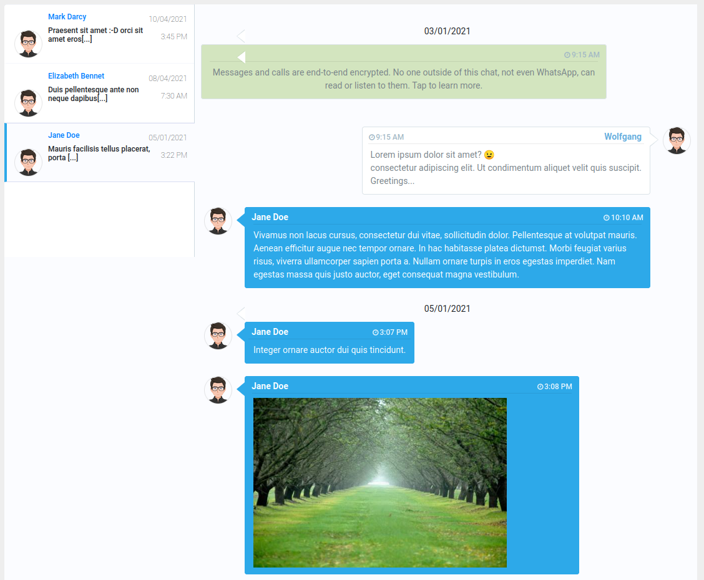

# WhatsApp Chat History Viewer

Provides means to display exported WhatsApp chats in a chat-like web interface.

## Motivation

After leaving WhatsApp, I wanted to keep the ability to review my exported chats in a convenient manner. The data source consists of text files containing the chat exports and the WhatsApp media files stored on my Android Phone.

I created a small web app with *server-side node.js with Typescript* + *client-side Bootstrap/jQuery code*.

## Prerequisites

What do need to run the application with your data?

* Copy all of your exported chat files (export must have happened without media) into the `data` folder. The file names have to match the pattern `WhatsApp Chat with <chat name>.txt`
* Create a link named `static/images` to the folder which contains the received WhatsApp images. The images sent by you are in a subfolder `Sent`. The file names follow the pattern `IMG-<YYYYMMDD>-*`.
* Create another link named `static/video` to the folder containing received WhatsApp videos. The expected file name pattern is `VID-<YYYYMMDD>-*`.

After setting up this data, run the node.js script `init_data.ts` using

```
npm run init_data
```

This script creates a file `data/chatProps.json` containing the time and content of your last conversation with each chat partner, to allow the chat list being sorted by your last interactions.

## Execute application

The application can be started with

```
npm start
```

Per default, it runs on local port 9080. Upon successful start, open the URL [http://localhost:9080].

## Example

When using the example chat data included in this project, the application presents itself as:



## Important

The chat export does not contain references to media files. Hence it's not possible to find exact matches when media content is mentioned in the chat export. The application tries its best to find a match, and in doubt, rather includes more media content in a chat than omitting content.

## Contributors

[Dey Dey](https://www.bootdey.com/users/profile/Dey-Dey) I'm not a UX guy, so I borrowed a bootstrap theme from him and 'abused' it to fit my needs